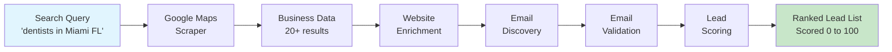
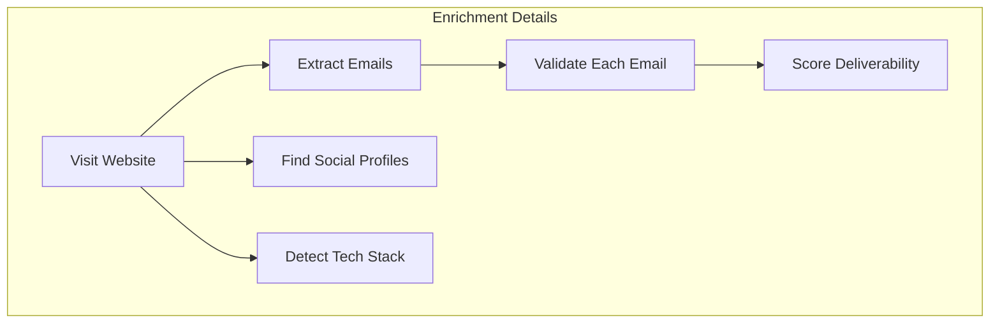

# Google Maps Lead Intelligence & Contact Enrichment

[](https://opensource.org/licenses/ISC)
[](https://apify.com/george.the.developer/google-maps-lead-intel)
[](https://nodejs.org)
[](https://pptr.dev)
[](https://apify.com/george.the.developer/google-maps-lead-intel)

Turn any Google Maps search into a complete, ready to use outreach list. One click gets you business contacts, validated emails, social profiles, and lead scores. The entire pipeline runs automatically while you focus on closing deals.

Built for lead gen agencies, local SEO companies, appointment setting services, and cold email teams who need qualified local business leads fast.

## Pipeline Architecture





## What You Get

Enter a search like "dentists in Miami FL" and receive a fully enriched lead package:

- **Business data** from Google Maps (name, address, phone, rating, reviews, hours, category)
- **Contact enrichment** (emails, social profiles, technologies, company description)
- **Email validation** (every email checked for deliverability before you get it)
- **Lead scoring** (0 to 100 score based on data quality and business signals)
- **Ranked list** sorted by lead quality, ready for immediate outreach

## Price Comparison: Why This Wins

| Method | Cost per search | Time | Quality |
|--------|----------------|------|---------|
| Manual research | $200+ (4 hours at $50/hr) | 4 hours | Inconsistent |
| Hiring a VA | $500/month + training | Days to ramp up | Variable |
| Apollo.io | $99/month for 5K credits | Still requires manual work | Limited to their database |
| ZoomInfo | $15,000+/year | Fast but pricey | Good but expensive |
| **This actor** | **$39 per search** | **Fully automatic, minutes** | **Real time Google Maps data** |

You save $161+ per search compared to manual research. Run 5 searches a month and you save $805+ while getting better data faster.

## Input

| Field | Type | Default | Description |
|-------|------|---------|-------------|
| searchQuery | string | required | What to search on Google Maps. Include location. Example: "plumbers in Dallas TX" |
| maxResults | integer | 20 | Maximum businesses to scrape (1 to 100) |
| enrichWebsites | boolean | true | Enrich each business with website contact data |
| validateEmails | boolean | true | Validate all discovered emails |
| minRating | number | 0 | Only include businesses with this rating or higher |

### Example Input

```json
{
  "searchQuery": "dentists in Miami FL",
  "maxResults": 20,
  "enrichWebsites": true,
  "validateEmails": true,
  "minRating": 3.0
}
```

## Output Example

Each lead in the output contains:

```json
{
  "rank": 1,
  "leadScore": 92,
  "businessName": "Smile Design Dental",
  "category": "Dentist",
  "address": "123 Main St, Miami, FL 33101",
  "phone": "+1-305-555-0123",
  "website": "https://smiledesigndental.com",
  "rating": 4.8,
  "reviewCount": 234,
  "hours": "Mon to Fri 8AM to 5PM",
  "googleMapsUrl": "https://maps.google.com/...",
  "emails": [
    {
      "email": "info@smiledesigndental.com",
      "valid": true,
      "score": 0.9
    }
  ],
  "socialProfiles": {
    "facebook": "https://facebook.com/smiledesigndental",
    "instagram": "https://instagram.com/smiledesigndental",
    "linkedin": "https://linkedin.com/company/smiledesigndental"
  },
  "enrichment": {
    "industry": "Healthcare",
    "technologies": ["WordPress", "Mailchimp", "Google Analytics"],
    "description": "Full service dental practice in Miami"
  },
  "enrichedAt": "2026-04-12T10:30:00.000Z"
}
```

## Lead Scoring Breakdown

Every lead gets a score from 0 to 100. Higher scores mean more complete data and stronger business signals:

| Signal | Points |
|--------|--------|
| Has phone number | +15 |
| Has website | +15 |
| Has email address | +20 |
| Email validated as deliverable | +10 |
| Rating 4.0 or higher | +15 |
| Rating 4.5 or higher | +5 bonus |
| More than 50 reviews | +10 |
| More than 100 reviews | +5 bonus |
| Has social profiles | +5 |

A score of 80+ means the lead has strong contact data and good business reputation. Start your outreach there.

## Use Cases

**Lead gen agencies**: Search for any local business type in any city. Get a complete outreach list in minutes instead of hours. Run multiple searches per day to fill your pipeline.

**Local SEO companies**: Find businesses in your target market that need SEO services. The tech stack data tells you what platform they use so you can tailor your pitch.

**Appointment setting services**: Get phone numbers and emails for local businesses. The lead score tells you which ones are worth calling first.

**Cold email teams**: Get validated email addresses ready for your email sequences. No more bounced emails killing your sender reputation.

**Real estate agents**: Find local service providers (contractors, inspectors, stagers) in any market. Build your referral network fast.

**Sales teams**: Research a local market before entering it. Know every competitor, their ratings, and how to reach them.

## Tips for Best Results

1. **Be specific with location**: "plumbers in Dallas TX" works better than just "plumbers"
2. **Use minRating filter**: Set minRating to 3.5 or 4.0 to focus on established businesses
3. **Start with 20 results**: The default of 20 gives you a solid list. Increase to 50 or 100 for larger markets
4. **Export as CSV**: Download results from the Dataset tab for easy import into your CRM or email tool
5. **Combine with scheduling**: Set up a weekly schedule to monitor new businesses in your target market

## Integrations

Export your leads directly to:

- Google Sheets (via Apify integration)
- Zapier (trigger on new dataset)
- Make / Integromat
- HubSpot, Salesforce, or any CRM via webhook
- CSV / JSON / Excel download

## Related Actors

| Actor | What It Does | Link |
|-------|-------------|------|
| Website Intelligence API | Full technology, SEO, and security analysis | [View](https://apify.com/george.the.developer/websight-api) |
| Email Validator API | Verify email deliverability at scale | [View](https://apify.com/george.the.developer/email-validator-api) |
| Company Enrichment API | Get company details from domain or name | [View](https://apify.com/george.the.developer/company-enrichment-api) |
| Website Contact Scraper | Extract contacts from any website | [View](https://apify.com/george.the.developer/website-contact-scraper) |

## Built by George Kioko

50+ actors on Apify, 869+ users. More at [apify.com/george.the.developer](https://apify.com/george.the.developer)

Questions or custom requirements? Open an issue on GitHub or reach out on X [@ai_in_it](https://x.com/ai_in_it).
